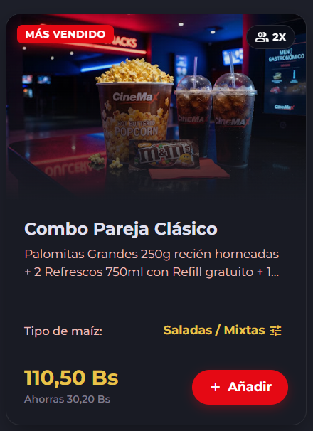

# 🎨 Guía Visual y Técnica: Manejo de Imágenes en Cards con Degradado Inferior y Efecto Hover (Zoom)

Esta guía explica cómo construir y reutilizar un componente CSS que permite mostrar imágenes dentro de una tarjeta (card) con dos efectos visuales clave:


1. **Un degradado oscuro en la base** que ayuda a que el texto sobre o debajo de la imagen se lea con claridad.  
2. **Un efecto de zoom sutil (Hover)** al pasar el cursor sobre la tarjeta.

Además, esta estructura elimina de raíz el fallo de la **línea horizontal flotante** (parpadeo de subpíxel) que ocurre en navegadores como Brave, Chrome y Edge cuando se combinan efectos de zoom con bordes redondeados.
## 📸 Vista Previa del Resultado



> **¿Cuándo usar este efecto?**
> 
> Úsalo cuando quieras tarjetas modernas y elegantes para catálogos de películas, productos de confitería, tarjetas de blog, eventos o servicios donde la imagen sea la protagonista.

## 💡 ¿Qué problema resuelve esta solución? (Explicado fácil)

Cuando le pides al navegador que agrande una foto al pasar el ratón (`scale`), el motor del navegador intenta redondear los decimales de los píxeles. En navegadores como Brave, Chrome o Edge, esto hace que por un milisegundo la imagen "desconecte" de la tarjeta, dejando ver una **pequeña línea o rendija vacía** entre la foto y el contenedor.
### La Solución Natural:

En lugar de pegar la foto y el degradado como piezas separadas:

1. Encerramos la imagen en una "caja de cristal" que la recorta (`overflow: hidden`).
2. Le ponemos una lámina transparente encima que ocupa todo el espacio (`inset: 0`) y que se va oscureciendo hacia la base.
3. Al hacer que el color final del degradado sea **exactamente igual al fondo de la tarjeta**, la línea se vuelve físicamente invisible.
## 🛠️ Código CSS Reutilizable

Añade estas clases a tu archivo de estilos global (`style.css` o `main.css`).

```CSS
/* ==========================================================================
   COMPONENTE GLOBAL: CONTENEDOR DE IMAGEN CON HOVER Y GRADIENTE
   ========================================================================== */

/* 1. CAJA DE CRISTAL (El marco recortador) */
.cm-card-media {
    position: relative;
    width: 100%;
    overflow: hidden;
    background-color: var(--cm-surface-container-lowest, #121417);
}

/* 2. LA FOTO (Efecto de Zoom) */
.cm-card-media-img {
    width: 100%;
    height: 100%;
    object-fit: cover;
    display: block;
    transition: transform 0.5s cubic-bezier(0.25, 1, 0.5, 1);
}

/* Acción de zoom al pasar el ratón sobre cualquier tarjeta contenedora */
.movie-card:hover .cm-card-media-img,
.cm-candy-card:hover .cm-card-media-img,
.card:hover .cm-card-media-img {
    transform: scale(1.05);
}

/* 3. LA LÁMINA TRANSPARENTE (Degradado que sella el borde) */
.cm-card-media-overlay {
    position: absolute;
    inset: 0;
    background: linear-gradient(
        to bottom,
        rgba(12, 14, 23, 0.2) 0%,
        transparent 40%,
        rgba(29, 31, 41, 0.6) 75%,
        var(--cm-surface-container, #1d1f29) 100%
    );
    pointer-events: none;
    z-index: 1;
}

/* 4. MODIFICADORES DE TAMAÑO (Para elegir la forma de la imagen) */
.cm-media-poster { aspect-ratio: 2 / 3; }   /* Formato Vertical / Póster */
.cm-media-landscape { aspect-ratio: 16 / 9; }/* Formato Panorámico / Banner */
.cm-media-candy { height: 210px; }           /* Formato de Altura Fija */
```

## 📖 Explicación de cada clase (Diccionario para el equipo)

Para entender qué hace cada línea sin necesidad de adivinar:

- **`.cm-card-media`**: Es el **marco o contenedor**. Ocupa todo el ancho de la tarjeta y usa `overflow: hidden` para actuar como una tijera: nada de lo que crezca dentro de esta caja se saldrá de los bordes.
    
- **`.cm-card-media-img`**: Es la **imagen real**. Le aplicamos `object-fit: cover` para que la foto se adapte y llene todo el marco sin deformarse ni aplastarse. La propiedad `transition` hace que el zoom sea suave y no un salto brusco.
    
- **`transform: scale(1.05)`**: Es la **animación de zoom**. Le indica a la imagen que aumente su tamaño un $5\%$ cuando el usuario pasa el ratón sobre la tarjeta.
    
- **`.cm-card-media-overlay`**: Es la **capa sombra de protección**. Con `inset: 0` le decimos que cubra exactamente el $100\%$ de la foto. Su degradado va desde un tono casi transparente arriba hasta un color oscuro sólido abajo. `pointer-events: none` permite que si el usuario hace clic sobre la foto, el clic traspase esta sombra y responda la tarjeta.
    
- **Modificadores (`.cm-media-poster`, etc.)**: Son etiquetas de forma. Te permiten decidir la proporción de la foto (si es alta como un póster o ancha como una pantalla) sin tener que escribir reglas CSS distintas para cada tarjeta.
    
## 💻 Ejemplo Práctico de Uso en HTML

Copia este bloque en tu HTML ajustando la clase del modificador de tamaño según la foto que necesites:

```HTML
<!-- Ejemplo: Tarjeta de Producto o Confitería -->
<div class="cm-candy-card rounded-3 border border-white-5 overflow-hidden">
    
    <!-- Contenedor con la forma deseada (.cm-media-candy, .cm-media-poster, etc.) -->
    <div class="cm-card-media cm-media-candy">
        <!-- Foto -->
        
        
        <!-- Capa de Sombra y Degradado Obligatoria -->
        <div class="cm-card-media-overlay"></div>
    </div>

    <!-- Cuerpo con la Información -->
    <div class="p-3 bg-cm-surface-container">
        <h4 class="text-white">Título de la Tarjeta</h4>
        <p class="text-muted">Descripción o detalles del contenido.</p>
    </div>

</div>
```

## 📌 3 Reglas de Oro para Recordar

1. **La capa `.cm-card-media-overlay` SIEMPRE debe ir DENTRO del marco `.cm-card-media`**. Si se coloca afuera, el efecto no sellará la imagen.
    
2. **El color base importa**: El último color del degradado en el CSS (`var(--cm-surface-container)`) debe coincidir con el color de fondo que tenga el cuerpo de la tarjeta.
    
3. **Usa los modificadores de proporción**: Evita asignarle `height` en píxeles a la imagen directamente (``). Es preferible darle el tamaño al marco contenedor `.cm-card-media`.